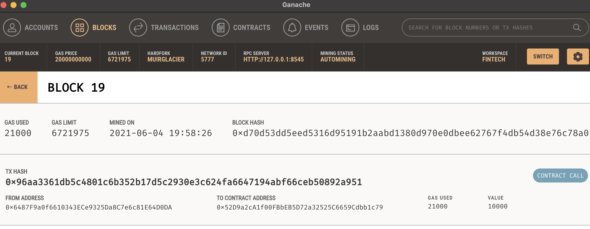

# Up-in-the-Air:
## An Exploration of the Airline Industry, Flight Delays, and the Purchase of Flight Insurance through the Blockchain

## Required Python Dependencies 
-	A requirements file to manage external dependencies (that are not included with a standard Python installation) used to run the app is made available [HERE](requirements.txt)
-	Recommendation: Install the Python packages listed in the requirements file in a [virtual environment]( https://packaging.python.org/tutorials/installing-packages/#optionally-create-a-virtual-environment), rather than installing them globally. 
-	The following command can be used to use pip to install the necessary Python Packages through the terminal for Mac: 
 python3 -m pip install "PackageName==Version" 

-- For example, in order to install [Streamlit](https://streamlit.io/) use: pip install streamlit==0.82.0
- [Ganache](https://www.trufflesuite.com/ganache) and [Metamask](https://metamask.io/) are also required in order to run and test the app locally. 

## Real-time Flight Status & Global Aviation Data API
- In order to access and retrieve global flight tracking data in real-time, we utilized [Aviationstack.](https://aviationstack.com/) A free API key is available for up to 500 requests. 
- Pictured below is a request to search for all flights departing from John F. Kennedy International Airport (JFK) to Madrid-Barajas Airport (MAD)

## Dashboard Web Application
- This repository contains a [Python script](streamlit_app.py) which is used to create a Webapp that has been deployed and is publicly available for viewing [HERE]( https://share.streamlit.io/rawnakmahjabib/up-in-the-air/main)
- The application is a dashboard that allows Users to locate real-time flights, view estimated departure/arrival times, whether or not a flight is delayed, and analyze public sentiment surrounding the airline industry through Tweets 🐦. Users are given the ability to purchase flight insurance through their Ether wallets and can claim their pay-outs using our Webapp.

### User Interface Design 

### Navigating the Sidebar (located on the far-left of the Webapp)
- By making different selections through the use of the radio button, Users are able to view random tweets containing either positive, neutral, or negative sentiment. Pictured below are examples of tweets containing positive and negative sentiment, respectively.  

- The sentiment data reveals that substantial flight delays are a common theme amongst airline customer complaints. 
- Users are also able to view different types of data visualization (i.e. Histogram or Pie Chart) depending on their preference by interacting with the selectbox. The checkbox can be clicked to hide or display the chosen visual. The visualizations were created using [Plotly.express](https://plotly.com/python/plotly-express/) and are pictured below:  

#### Tweet Locations (Based on the time of day)
- Users can interact with the slider to view the number of airline-related tweets during the selected hour of the day along with the regions the tweets are originating from. Using Streamlit's syntax "st.map()", the Webapp displays the data points on a map as pictured below:  

#### Airline Comparison Tool
- The multiselect dropdown enables Users to select various U.S. Airlines and compare the number of tweets, categorized by sentiment, in relation to the other. Pictured below is a comparison of United, Delta, and American Airlines.  

#### Wordclouds Based on Sentiment 
- Use of the radio button, allows Users to populate and display a [WordCloud](https://amueller.github.io/word_cloud/generated/wordcloud.WordCloud.html) based on positive, neutral, or negative sentiment. Pictured below is a WordCloud visual representation of words associated with negative customer complaints. 
- One can see below that there are variious phrases indicatiing that customers are expressing concerns regarding flight delays - such as "late flight," "delay," "delayed," etc. 

## Successfully Purchasing Flight Insurance through the Webapp. 
- Once the form required to buy insurance is filled out properly - by providing a first/last name, ticket # (for testing purposes, a User can enter a random series of numbers), airline code, flight number, departure date, and testETH wallet information - and submitted, the transaction can be verified on the local Ganache Workspace. Picture below is a successful purchase of flight insurance on our personal blockchain: 

